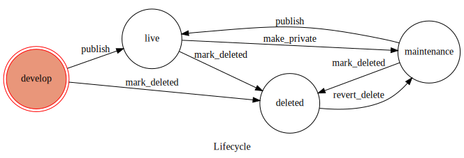

Quickstart
============

Lets implement the following state machine.

 - The object starts of as 'under development' which can then be made 'live'.
 - From the 'live' state it can be marked as 'under maintenance'.
 - From all states the object can be marked as 'deleted'.
 - A 'deleted' object can be recovered into the 'under maintenance' state.
 - Whenever a transition occurs the datetime will be recorded in a datefield.

Import the dependencies::

    from django_transitions.workflow import StateMachineMixinBase
    from django_transitions.workflow import StatusBase
    from transitions import Machine

States and Transitions
-------------------------

We start by defining the states and transitions

.. literalinclude:: ../../testapp/workflows.py
   :pyobject: LiveStatus

Statemachine Mixin
-------------------

Next we create a mixin to create a state machine for the django model.

.. note:: The mixin or the model *must* provide a state property.
    In this implementation state is mapped to the
    django model field ``wf_state``

The mixin **must** override the ``machine`` of the ``StateMachineMixinBase`` class.
The minimum boilerplate to achieve this is::

    machine = Machine(
        model=None,
        **status_class.get_kwargs()
    )

In the example we also define a ``wf_finalize`` method that will set the
date when the last transition occurred on every transaction.

.. literalinclude:: ../../testapp/workflows.py
   :pyobject: LifecycleStateMachineMixin

Model
-------

Set up the django model

.. literalinclude:: ../../testapp/models.py
   :pyobject: Lifecycle

We can now inspect the behaviour of the model model with
``python manage.py shell`` ::

    >>> from testapp.models import Lifecycle
    >>> lcycle = Lifecycle()
    >>> lcycle.state
    'develop'
    >>> lcycle.publish()
    True
    >>> lcycle.state
    'live'
    >>> lcycle.publish()
    Traceback (most recent call last):
      File "<console>", line 1, in <module>
      File "/home/christian/devel/django-transitions/.venv/lib/python3.5/site-packages/transitions/core.py", line 383, in trigger
        return self.machine._process(func)
      File "/home/christian/devel/django-transitions/.venv/lib/python3.5/site-packages/transitions/core.py", line 1047, in _process
        return trigger()
      File "/home/christian/devel/django-transitions/.venv/lib/python3.5/site-packages/transitions/core.py", line 397, in _trigger
        raise MachineError(msg)
    transitions.core.MachineError: "Can't trigger event publish from state live!"
    >>> lcycle.save()
    >>> graph = lcycle.get_wf_graph()
    >>> graph.draw('lifcycle_state_diagram.svg', prog='dot')  # This produces the above diagram

Admin
-------

Set up the django admin to include the workflow actions.

.. literalinclude:: ../../testapp/admin.py
